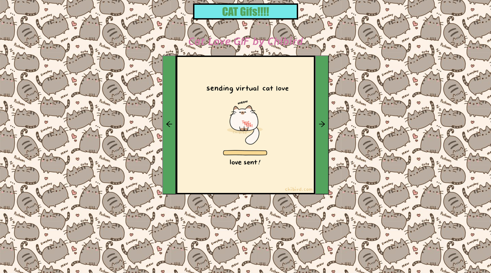

# Cat Gifs jSON API 
---
## Description
This is a slider Ui i pattern in React. The user sees a random cat gif on the screen with Next and Previous' buttons.  When the user clicks on the Previous button the slider  shift to show the previous Gif in the list and the Next button shows a new gif.

---
#### Screenshot

---
#### Technologies Used
- JavaScript
- React
- Node fetch
---
#### Deployed link
https://coruscating-rugelach-9c2a94.netlify.app/